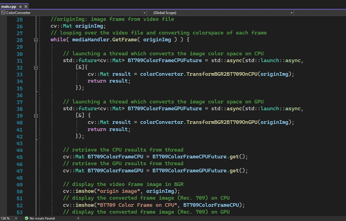

Object Oriented example of Cuda programming in C++ for color transforming video frame from BGR to BT.709

The program utilizes C++ and CUDA to process video files via the OpenCV library, converting each frame from the BGR color space to Rect. 709. This conversion is performed on both the CPU and GPU, with CUDA kernels launched for the latter. The results from both computations are then displayed simultaneously. Asynchronous operations are employed for CPU and GPU computations, utilizing two separate threads managed through std::future. Additionally, the efficiency of the CUDA kernel was evaluated using Nvidia Nsight Compute for memory bandwidth optimization. CMake serves as the build system tool for the program's development.

Main Function for displaying the GPU & CPU results:
As shown in the image, I have defined two classes: one handling the video file opening and retrieving camera images, and another class for handling the color space conversion on either GPU or CPU.
Moreover, the computation on CPU & GPU are async operations using std::future.

